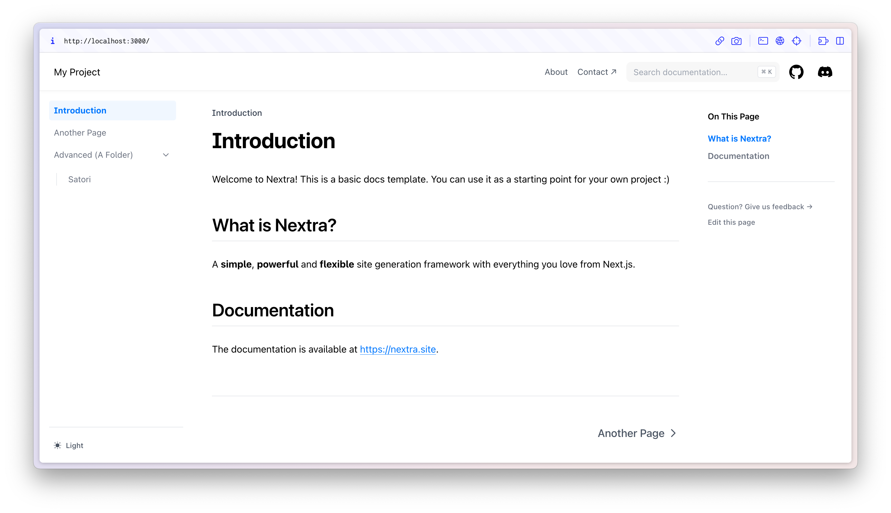

# Nextra Docs Template 

This is a template for creating documentation with [Nextra](https://nextra.site).

[**Live Demo →**](https://nextra-docs-template.vercel.app)

## Quick Start

Click the button to clone this repository and deploy it on Vercel:

## Local Development

First, run `pnpm i` to install the dependencies.

Then, run `pnpm dev` to start the development server and visit localhost:3000.

## Dependency Maintenance

Use `pnpm install --frozen-lockfile` and `pnpm audit` to reproduce and check the dependency tree. Automatic peer installation is disabled because this web-only app does not need React Native. Required application peers are declared in `package.json`.

Scoped overrides provide patched Lodash, PostCSS, XML parser, and KaTeX versions where upstream packages retain vulnerable constraints. Recheck compatibility before removing or updating these overrides.

Nextra and its theme retain Zod 4.1.13: upgrading to 4.6.5 caused their layout validation to reject `children` during prerendering. Retest this compatibility pin when updating Nextra.

As of 2026-10-09, the audit retains one high-severity advisory: [braces stack-exhaustion denial of service](https://github.com/advisories/GHSA-vfj7-8cjw-p6xm), through `nextra > fast-glob > micromatch > braces`. The registry reports no patched release. Nextra's inspected page-discovery code supplies repository/configuration-derived glob patterns; no visitor-controlled pattern path was found in this review. This limits the observed exposure but does not resolve the advisory. Do not accept untrusted glob patterns; re-audit when upstream releases a fix. The advisory is not suppressed.

Production builds require `NEXT_PUBLIC_SUPABASE_URL` and `NEXT_PUBLIC_SUPABASE_ANON_KEY`. Empty local test data can verify compilation, page generation, and search indexing, but does not verify production database integration. Never deploy a build generated with test configuration.

## License

This project is licensed under the MIT License.
