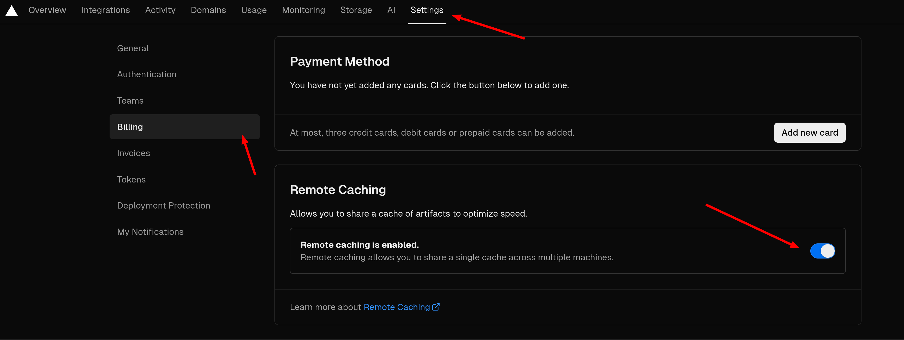

# how I build this blog

## thoughts

I will use tag more than headings, tag is better for searching and can avoid nested hierarchy, also it's easier to create a tag than decide a heading.

I will log my digital life so I will be more trackable rather than opaque. Digital world is a water surface for users, I want to change this.

## font-display

There are three fonts used in this blog, they almost took 20MB.

I need use `font-display: swap;` so the downloading of the font [won't block](https://developer.mozilla.org/en-US/docs/Web/CSS/@font-face/font-display) the text showing up.

```css
@font-face {
  font-family: "Klee One Regular";
  src: url("/fonts/KleeOne-Regular.ttf") format("truetype");
  font-weight: 400;
  font-style: normal;
  font-display: swap;
}
```

## make VSCode spell check work for mdx

- Open an MDX file.
- `Ctrl + Shift + p` Enable Spell Checking Document Language

https://github.com/streetsidesoftware/vscode-spell-checker/issues/657#issuecomment-755459018

If using vscode ssh, need to install Code Spell Checker extension in ssh again(there will be a button `Install in SSH: 123.123.123.123` )

## make image showing

If I have a mdx file in a folder, eg. `archived/ielts.mdx` , I need to use `src="../images/name of the image"` to make it showing.

## variable

I have to use `export` to define a variable/constant.

```tsx
export const photos = ["PXL_20240327_064431662.jpg"];
```

If I use `const photos` it will give me error.

## nextra 和 vercel 结合生成 bug

> tldr: 在 vercel 里设置 environment variable `VERCEL_FORCE_NO_BUILD_CACHE = 1`


我也不知怎么回事，也许 nextra 的 static site generation 和 vercel cache 产生奇妙反应，侧边栏就会出现类似 stale state 的现象。

我试试这篇文章推上去，让 vercel 自动 deploy 看看会不会有问题。

据说要 [把 remote caching 关了](https://github.com/vercel/vercel/discussions/8057#discussioncomment-4585346)



再试一次，原神启动！

原神再启动！

原神启不动！

我的初心是写博客，不是搞技术，更不是写技术博客。

还是要 [设置环境变量来跳过 build cache](https://github.com/vercel/vercel/discussions/8057#discussioncomment-3057196)

> EDIT (14th Oct 2022): The `VERCEL_FORCE_NO_BUILD_CACHE` env var now exists! Set this to `1` and the build cache will be skipped.


终于， [原神亲自启动](./genshin.mdx) 了。

import RichImage from "components/image/RichImage";

<RichImage effect="hoverClear" src="/images/2024-02-17-23-34-44.png" />

## install tailwind CSS

```tsx filename="_app.tsx"
import type { AppProps } from "next/app";
import "../globals.css"; // this must be put here

export default function App({ Component, pageProps }: AppProps) {
  return <Component {...pageProps} />;
}
```

[Install Tailwind CSS with Next.js](https://tailwindcss.com/docs/guides/nextjs)

这些 [没有文档记录的东西](https://github.com/shuding/nextra/issues/2573) ，不知哪天就会 Move fast , break things!

## add RSS support

I found that there are a rss generator of nextra blog theme, I'm gonna give it a try.

create `script/gen-rss.js` , fill it with [gen-rss.js](https://github.com/vercel/nextjs-portfolio-starter/blob/main/scripts/gen-rss.js)

modify package.json

add the rss generation to build command

```json
    "build": "node ./scripts/gen-rss.js && next build",
```

add new dependencies

```json
    "gray-matter": "^4.0.3",
    "rss": "^1.2.2"
```

~~install dependencies and run `build`~~ of course it won't work, I'm using the nextra doc theme, it doesn't have frontmatter

finally I managed to publish the `feed.xml` , but there isn't any title & content! But it can give the notification anyway. Move fast!

## back to top

to do

## environment variable

https://nextjs.org/docs/app/building-your-application/configuring/environment-variables#loading-environment-variables

create `.env.local` and use it like `process.env.SOME_ENV`

## other

For safari, [video tag](https://developer.mozilla.org/en-US/docs/Web/HTML/Element/video) should have `playsinline` , otherwise it will jump out to fullscreen. If using JSX, [maybe should](https://stackoverflow.com/a/68219309/6236633) use `webkit-playsinline={true}`

```tsx
<div className="flex flex-col items-center justify-center">
  <video
    className="w-full h-auto md:w-80"
    autoPlay
    muted
    loop
    playsinline
    webkit-playsinline={true}
  >
    <source src="videos/ezgif-7-53636bcd6f.mp4" type="video/mp4" />
    Your browser does not support the video tag.
  </video>
  <Caption children={"《天下无贼》中找到了生活的其他部分的劫匪"} />
</div>
```

Friend with iPhone 12 says that it's still not working. The video still jump out. Okay, I'll go back to gif. [Feck it](https://www.quora.com/What-are-words-that-can-replace-the-f-word).

看了看 svelte4 ，据说 [又要 svelte5](https://svelte.dev/blog/runes) ，语法大改动。也许 [用无聊的技术](https://boringtechnology.club/) 是对的，你还在各种技术栈反复横跳， [jquery 都 4 beta 了](https://blog.jquery.com/2024/02/06/jquery-4-0-0-beta/) , [PHP 都兰博基尼了](https://x.com/taylorotwell/status/1647010323147177985?s=20) 。
