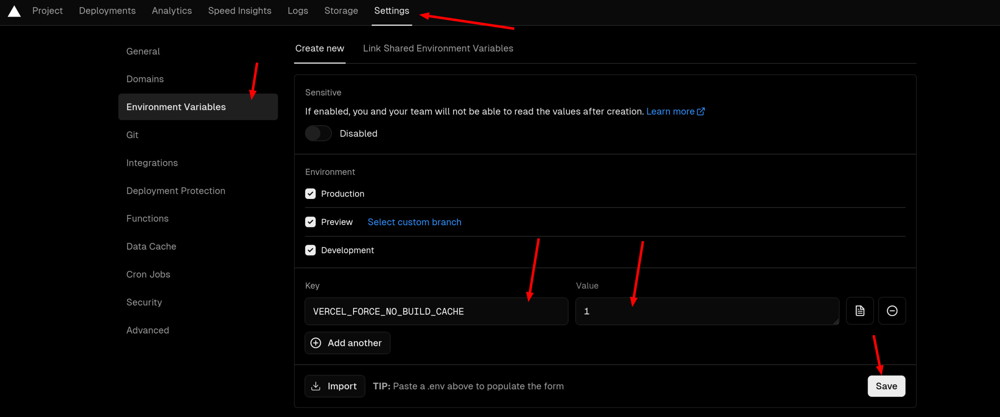

# how I build this blog

## font-display

There are three fonts used in this blog, they almost took 20MB. 

I need use `font-display: swap;` so the downloading of the font [won't block](https://developer.mozilla.org/en-US/docs/Web/CSS/@font-face/font-display) the text showing up.

```css
@font-face {
  font-family: "Klee One Regular";
  src: url("/fonts/KleeOne-Regular.ttf") format("truetype");
  font-weight: 400;
  font-style: normal;
  font-display: swap;
}
```

## make VSCode spell check work for mdx

- Open an MDX file.
- `Ctrl + Shift + p` Enable Spell Checking Document Language

https://github.com/streetsidesoftware/vscode-spell-checker/issues/657#issuecomment-755459018

## make image showing

If I have a mdx file in a folder, eg. `archived/ielts.mdx` , I need to use `src="../images/name of the image"` to make it showing.

## nextra 和 vercel 结合生成 bug

> tldr: 在 vercel 里设置 environment variable `VERCEL_FORCE_NO_BUILD_CACHE = 1`


我也不知怎么回事，也许 nextra 的 static site generation 和 vercel cache 产生奇妙反应，侧边栏就会出现类似 stale state 的现象。

我试试这篇文章推上去，让 vercel 自动 deploy 看看会不会有问题。

据说要 [把 remote caching 关了](https://github.com/vercel/vercel/discussions/8057#discussioncomment-4585346)


再试一次，原神启动！

原神再启动！

原神启不动！

我的初心是写博客，不是搞技术，更不是写技术博客。

还是要 [设置环境变量来跳过 build cache](https://github.com/vercel/vercel/discussions/8057#discussioncomment-3057196)

> EDIT (14th Oct 2022): The `VERCEL_FORCE_NO_BUILD_CACHE` env var now exists! Set this to `1` and the build cache will be skipped.



终于， [原神亲自启动](./genshin.mdx) 了。

import RichImage from '../components/RichImage'

<RichImage effect='hoverClear' src='/images/2024-02-17-23-34-44.png' />

## install tailwind CSS

```tsx filename="_app.tsx"
import type { AppProps } from "next/app";
import "../globals.css"; // this must be put here

export default function App({ Component, pageProps }: AppProps) {
  return <Component {...pageProps} />;
}
```

[Install Tailwind CSS with Next.js](https://tailwindcss.com/docs/guides/nextjs)

这些 [没有文档记录的东西](https://github.com/shuding/nextra/issues/2573) ，不知哪天就会 Move fast , break things! 


## add RSS support

I fond that there are a rss generator of nextra blog theme, I'm gonna give it a try.

~~
create `script/gen-rss.js` , fill it with [gen-rss.js](https://github.com/vercel/nextjs-portfolio-starter/blob/main/scripts/gen-rss.js)


modify package.json 

add the rss generation to build command

```json
    "build": "node ./scripts/gen-rss.js && next build",
```

add new dependencies

```json
    "gray-matter": "^4.0.3",
    "rss": "^1.2.2"
```

~~

~~install dependencies and run `build` ~~ of course it won't work, I'm using the nextra doc theme, it doesn't have frontmatter

finally I managed to publish the `feed.xml` .


