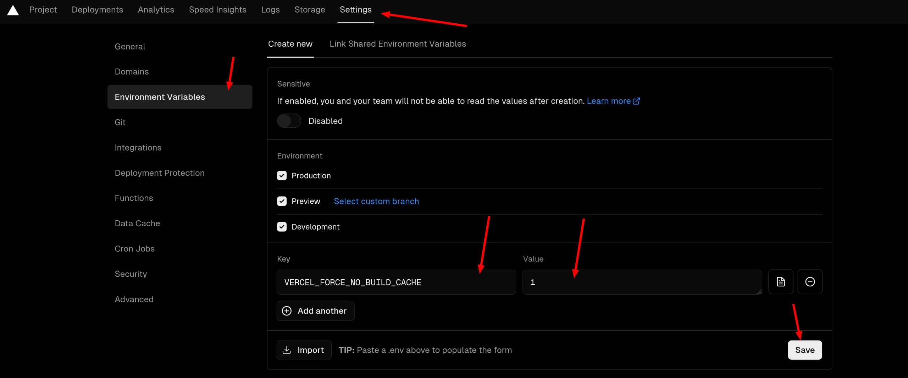

# nextra 和 vercel 结合生成 bug

> tldr: 在 vercel 里设置 environment variable `VERCEL_FORCE_NO_BUILD_CACHE = 1`

我也不知怎么回事，也许 nextra 的 static site generation 和 vercel cache 产生奇妙反应，侧边栏就会出现类似 stale state 的现象。

我试试这篇文章推上去，让 vercel 自动 deploy 看看会不会有问题。

据说要 [把 remote caching 关了](https://github.com/vercel/vercel/discussions/8057#discussioncomment-4585346)

再试一次，原神启动！

原神再启动！

原神启不动！

我的初心是写博客，不是搞技术，更不是写技术博客。

还是要 [设置环境变量来跳过 build cache](https://github.com/vercel/vercel/discussions/8057#discussioncomment-3057196)

> EDIT (14th Oct 2022): The `VERCEL_FORCE_NO_BUILD_CACHE` env var now exists! Set this to `1` and the build cache will be skipped.

终于， [原神亲自启动](./genshin.mdx) 了。

import RichImage from '../components/RichImage'

<RichImage effect='hoverClear' src='/images/2024-02-17-23-34-44.png' />
